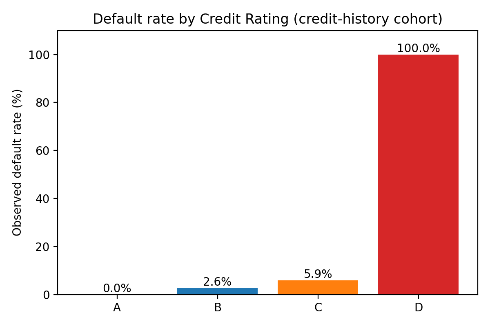
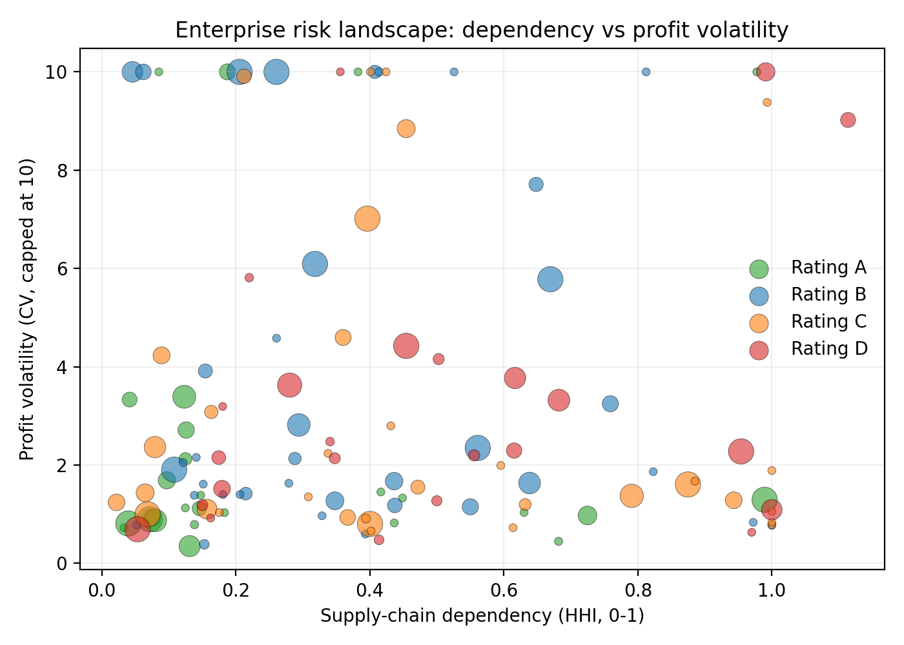
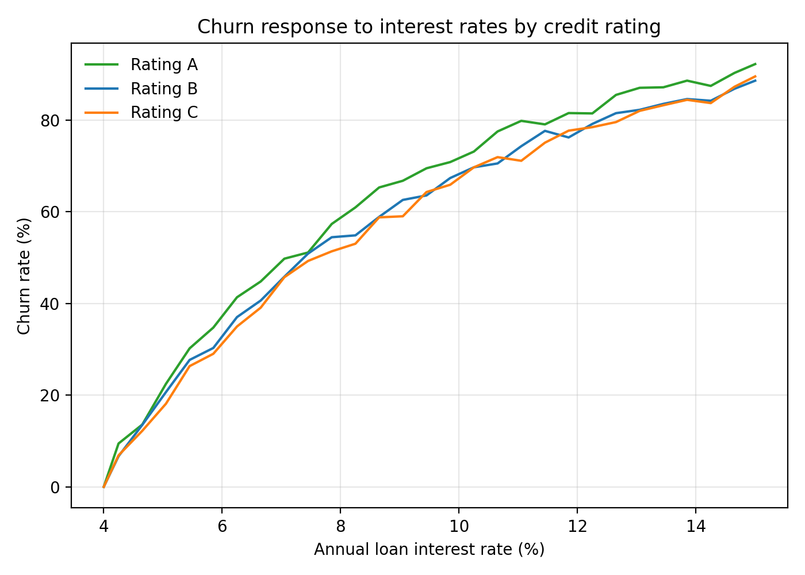

Executive summary
- Allocate 100M RMB to credit-history enterprises with a risk-based schedule: A 70.97M (4.65% rate), B 13.32M (5.05%), C 15.70M (5.45%); D is excluded (100% default rate). To achieve 100M deployed after churn, offer ~120.23M RMB in total (A 82.12M, B 16.79M, C 21.31M).
- Observed default rates are starkly tiered: A 0.00%, B 2.63%, C 5.88%, D 100.00% (SQL: ch___company_info). Revenue capacity and operational stability further support overweighting A: average monthly sales A 8.56M, B 1.47M, C 2.65M, D 0.094M; profit volatility (median CV) A 1.13, B 1.98, C 1.49, D 2.29; dependency (mean HHI) A 0.283, B 0.378, C 0.486, D 0.492 (Python: monthly aggregates from ch___sales_invoices and ch___input_invoices, valid invoices only).
- Expected net interest and losses (LGD=45%, PD=observed default rates) yield an estimated net profit of ~3.44M RMB on the deployed 100M RMB (A 2.85M, B 0.38M, C 0.21M).

Visual evidence and key takeaways
- Default risk distribution by rating. Observation: Default rates rise sharply with lower ratings: A 0.00% (0/27), B 2.63% (1/38), C 5.88% (2/34), D 100.00% (24/24). Root cause: lower credit ratings reflect historically weaker repayment behavior. Impact: D is unbankable in unsecured lending; minimize exposure to C/B without strong mitigations.

- Enterprise risk landscape (dependency vs. profit volatility). Observation: Higher ratings cluster with lower supply-chain concentration and somewhat lower volatility (A mean HHI 0.283, median profit CV 1.13) versus C/D (C HHI 0.486, CV 1.49; D HHI 0.492, CV 2.29). Root cause: diversified buyers/suppliers and steadier margins reduce cash-flow risk. Impact: Limits should be higher for diversified, stable firms and penalize concentrated, volatile ones.

- Churn sensitivity to interest rates (from annual_rate_&_churn). Observation: At the selected base rates, expected churn is A 13.57% at 4.65%, B 20.66% at 5.05%, C 26.33% at 5.45%. Root cause: price sensitivity differs by rating—lower risk (A) tolerates lower rates to retain, higher risk (C) requires a premium but faces higher churn. Impact: To deploy 100M, we must over-offer ~120.23M RMB to offset churn.

Data and method (what was analyzed and why)
- Datasets: ch___company_info (rating, default flag), ch___sales_invoices & ch___input_invoices (valid invoices only), annual_rate_&_churn (interest vs churn by rating).
- Revenue capacity: average monthly sales per enterprise from sales invoices (SQL→Python groupby).
- Profit stability: monthly profit = sales − inputs; volatility via coefficient of variation (CV = std/|mean|) per enterprise (Python).
- Supply-chain dependency: HHI computed on buyer (downstream) and seller (upstream) invoice shares; enterprise dependency_hhi = max(downstream HHI, upstream HHI) (Python).
- Default risk by rating: counts and rates from the company_info table (SQL).
- Churn mapping: interpolated churn at chosen rates from annual_rate_&_churn (Python).

Key insights with business implications
1) Default risk escalates by rating (A 0.00%, B 2.63%, C 5.88%, D 100.00%).
   - Observation: SQL shows defaults concentrated entirely in D; low rates in A.
   - Root Cause: weaker credit history and repayment capacity in lower ratings.
   - Impact/Recommendation: Exclude D from unsecured credit; require full collateral or guarantees if any exposure. Keep C/B allocations limited and priced to expected loss.

2) A-rated firms have the strongest revenue capacity and more balanced supply chains.
   - Observation: Avg monthly sales A 8.56M vs B 1.47M and C 2.65M; mean dependency HHI A 0.283 (more diversified).
   - Root Cause: broader customer/supplier bases, stronger commercial scale.
   - Impact/Recommendation: Overweight A (71% of 100M) at a competitive rate (4.65%) to maximize safe volume and retention; prioritize relationship expansion.

3) Volatility and concentration amplify risk in B/C.
   - Observation: Profit CV medians B 1.98 and C 1.49 (vs A 1.13); HHI B 0.378, C 0.486.
   - Root Cause: reliance on fewer partners; swingy profits increase cash-flow stress.
   - Impact/Recommendation: Apply limit penalties to high HHI and high CV; embed covenants (receivables monitoring, inventory audits, assignment of proceeds) to mitigate concentration risk.

Credit allocation plan (100M RMB) and expected returns
- Deployed amounts (from allocation_by_rating.csv using base-limit normalization):
  - A: 70.97M RMB at 4.65% with churn 13.57% → expected net interest 2.85M; expected loss 0; net profit 2.85M.
  - B: 13.32M RMB at 5.05% with churn 20.66% → expected net interest 0.534M; expected loss 0.158M; net profit 0.376M.
  - C: 15.70M RMB at 5.45% with churn 26.33% → expected net interest 0.630M; expected loss 0.416M; net profit 0.215M.
- Total expected net profit ≈ 3.44M RMB (LGD=45%, PD=observed default rates; interest on retained volume only).
- Offer volumes to offset churn and hit deployment: A 82.12M, B 16.79M, C 21.31M → Total 120.23M RMB.

Risk-based limit rules (enterprise-level)
Per enterprise limit is derived from operating strength and risk:
- Base formula: Limit = 30% × Avg Monthly Sales × Rating factor × Stability factor × Dependency factor
  - Rating factor: A=1.20; B=1.00; C=0.70; D=0.00 (defaulted or highest risk excluded).
  - Stability factor (by profit CV):
    - CV ≤ 0.50 → 1.10
    - 0.50 < CV ≤ 1.00 → 1.00
    - 1.00 < CV ≤ 2.00 → 0.80
    - CV > 2.00 or CV is NaN/∞ → 0.60
  - Dependency factor (by HHI, 0–1): F = 1 − 0.5 × max(0, HHI − 0.2), clipped to [0.60, 1.10]
    - HHI ≤ 0.20 → ~1.00
    - HHI 0.20–0.50 → 0.75–1.00 (linear penalty)
    - HHI > 0.50 → 0.60–0.75 (strong penalty)
- Defaulted firms: Limit=0 unless fully collateralized.
- Rationale: Higher revenue capacity, lower volatility, and diversified counterparties justify larger lines; concentration and instability reduce limits to protect the bank.

Interest rate rules (rating-level with risk adjustments and churn awareness)
- Base annual rates by rating (used in plan): A 4.65%; B 5.05%; C 5.45% (from churn-response table).
- Adjustments to base rate to reflect enterprise-specific risk:
  - Profit CV add-ons:
    - CV ≤ 0.50: −20 bps
    - 0.50–1.00: 0 bps
    - 1.00–2.00: +25 bps
    - >2.00: +50 bps
  - HHI add-ons:
    - HHI ≤ 0.20: 0 bps
    - 0.20–0.50: +10–20 bps (scaled)
    - >0.50: +25–35 bps
- Churn incorporation: Use the annual_rate_&_churn curves to estimate rating-level churn at the offered rate; scale gross offers to Offer = Deploy / (1 − churn). In our plan: A 13.57% churn, B 20.66%, C 26.33% → 120.23M RMB offers for 100M deployed.

Operational controls and covenants
- For B/C with HHI > 0.50 or CV > 2.00: require assignment of receivables, supplier diversification plans, tighter borrowing bases, and monthly reporting of top buyers/suppliers.
- Trigger-based limit reviews when CV rises >0.5 points or HHI increases >0.1 absolute.
- For any D engagement (if unavoidable): full collateral, guarantees, or insured receivables; otherwise no unsecured lines.

Appendix: Evidence and exact metrics
- Default rates (ch___company_info):
  - A: 0/27 (0.00%), B: 1/38 (2.63%), C: 2/34 (5.88%), D: 24/24 (100.00%).
- Capacity, stability, and dependency (Python from monthly valid invoices):
  - Avg monthly sales: A 8.56M; B 1.47M; C 2.65M; D 0.094M RMB.
  - Profit CV (median): A 1.13; B 1.98; C 1.49; D 2.29.
  - Dependency HHI (mean): A 0.283; B 0.378; C 0.486; D 0.492.
- Allocation and returns (allocation_by_rating.csv):
  - Deployed: A 70.97M; B 13.32M; C 15.70M (sum 100M).
  - Offer to offset churn: A 82.12M; B 16.79M; C 21.31M (sum 120.23M).
  - Expected net interest: A 2.85M; B 0.534M; C 0.630M.
  - Expected loss: B 0.158M; C 0.416M; net profit: A 2.85M; B 0.376M; C 0.215M; total ≈ 3.44M RMB.

Notes on methodology and reproducibility
- We used only Valid Invoice records (status filter) across 2016-10-07 to 2020-02-21 (SQL scan).
- Profit = sales − inputs; CV computed per enterprise; HHI computed on buyer/seller shares; dependency_hhi is the max of upstream/downstream HHI to capture worst-case concentration risk.
- Churn-response curves were read from annual_rate_&_churn; churn at selected rates derived via interpolation.
- Python plotting code executed (analysis.py) created three images: default_rate_by_rating.png, risk_scatter.png, churn_vs_rate.png and CSV outputs (rating_summary.csv, allocation_by_rating.csv, enterprise_risk_metrics.csv).

Next steps
- Roll out the limit/rate rule engine; backtest on out-of-sample months to validate loss and churn forecasts.
- Implement covenant monitoring for B/C; build dashboards tracking CV and HHI quarterly.
- Pilot relationship pricing for A to further reduce churn (explore 4.40–4.65% bands) while maintaining net profit.
