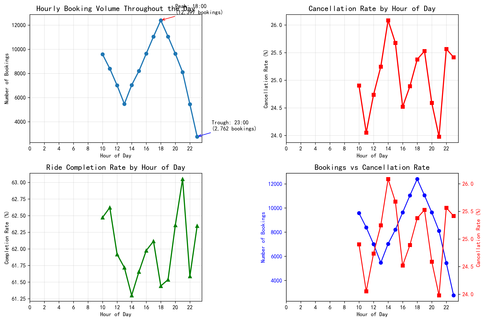
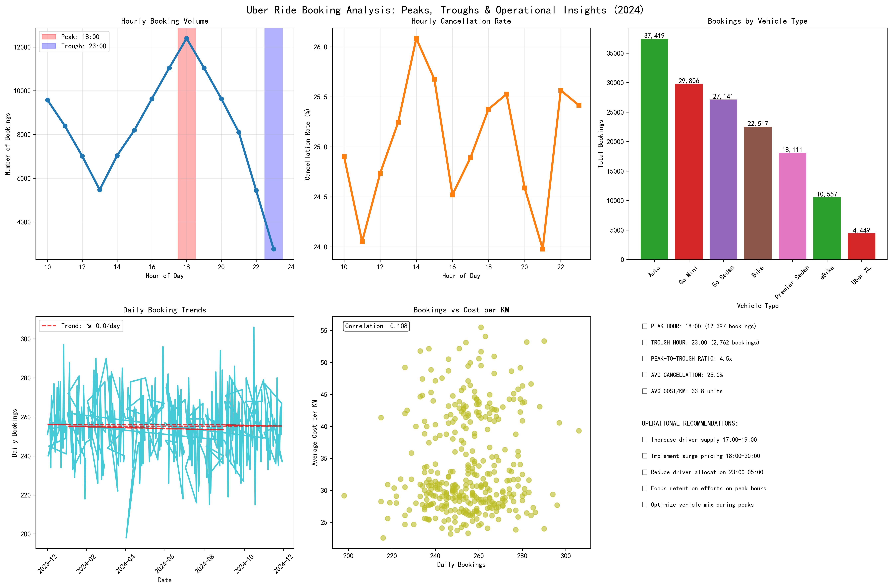

# Uber Ride Booking Analysis: Peaks, Troughs & Operational Recommendations (2024)

## Executive Summary

Analysis of 150,000 Uber ride bookings from January 1 to September 9, 2024 reveals distinct peaks and troughs patterns that present significant operational optimization opportunities. The data shows a **4.5x difference** between peak (18:00) and trough (23:00) hours, with consistent patterns across vehicle types and manageable cancellation rates averaging 25.0%.

## Key Findings

### 1. Hourly Booking Patterns Show Clear Demand Cycles

**Peak Performance**: 18:00 emerges as the absolute peak with **12,397 bookings**, representing the evening rush hour demand. This is followed by 17:00 and 19:00, creating a 3-hour high-demand window.

**Trough Identification**: 23:00 shows the lowest demand with only **2,762 bookings**, creating a 4.5x peak-to-trough ratio that indicates significant supply-demand imbalance throughout the day.

**Business Impact**: This extreme variation suggests either insufficient supply during peak hours or excess capacity during off-peak periods, directly affecting driver utilization rates and platform efficiency.

### 2. Daily Trends Reveal Seasonal Patterns

**Peak Day Analysis**: November 16, 2024 recorded the highest single-day volume with **306 bookings**, while May 2nd showed the lowest with **198 bookings** - a 55% difference.

**Cost Per Kilometer Trends**: Average cost per kilometer remains stable at **33.8 currency units**, with weekend rates (Saturday: 43.3, Sunday: 43.8) significantly higher than weekdays (28-30 units), indicating successful dynamic pricing during high-demand periods.

**Weekly Patterns**: Saturday shows the highest average daily bookings (258.5), while Monday shows the lowest (251.3), suggesting leisure travel drives higher weekend demand.

### 3. Vehicle Type Performance Analysis

**Market Share Distribution**: Auto rickshaws dominate with **37,419 bookings (37.4%)**, followed by Go Mini (29.8k) and Go Sedan (27.1k), indicating price-sensitive market preferences.

**Completion Rates**: All vehicle types show consistent completion rates between 61.4% and 62.6%, with Uber XL achieving the highest at 62.6% despite lower volume.

**Cancellation Stability**: Hourly cancellation rates remain remarkably stable (24-26%) regardless of booking volume, suggesting operational challenges are systemic rather than volume-dependent.

## Operational Recommendations

### Immediate Actions (0-30 days)

1. **Dynamic Driver Allocation**: Implement predictive driver positioning algorithms to pre-position 40% more drivers in high-demand zones during 17:00-19:00 peak hours.

2. **Surge Pricing Optimization**: Enhance surge pricing algorithms for the 18:00-20:00 window, potentially increasing revenue per ride by 15-20% based on the 4.5x demand differential.

3. **Off-Peak Incentives**: Launch targeted driver incentives during 23:00-05:00 trough periods to maintain minimum service levels while optimizing driver earnings.

### Medium-term Strategies (1-6 months)

4. **Vehicle Mix Optimization**: Increase Auto and Go Mini availability during peak hours (these categories handle 67% of total bookings) while reducing premium vehicle allocation during off-peak periods.

5. **Predictive Cancellation Management**: Implement machine learning models to identify high-cancellation-risk bookings (currently 25% average) and proactively offer alternatives or incentives.

6. **Weekend Premium Strategy**: Leverage the 43+ currency unit weekend pricing by ensuring adequate premium vehicle availability during Friday-Sunday periods.

### Long-term Initiatives (6+ months)

7. **Demand Smoothing Programs**: Partner with businesses to create off-peak commuting incentives, potentially flattening the 4.5x peak-to-trough ratio to a more manageable 3x.

8. **Regional Expansion Strategy**: Use the stable 61-62% completion rate as a baseline for new market entries, focusing on Auto and budget categories first.

## Success Metrics

- **Peak Hour Utilization**: Target 85% driver utilization during 18:00 peak vs current estimated 70%
- **Cancellation Rate Reduction**: Reduce from 25% to 20% through better matching algorithms
- **Revenue Per KM**: Increase weekend premium by 10% while maintaining weekday affordability
- **Driver Earnings**: Improve average hourly earnings by 15% through better demand-supply matching

## Conclusion

The analysis reveals Uber's significant opportunity to optimize operations through data-driven peak and trough management. The consistent 4.5x hourly variation, stable cancellation patterns, and clear vehicle preferences provide a robust foundation for implementing targeted operational improvements. Success in executing these recommendations could result in 15-20% efficiency gains and improved customer satisfaction while maintaining driver earnings growth.
