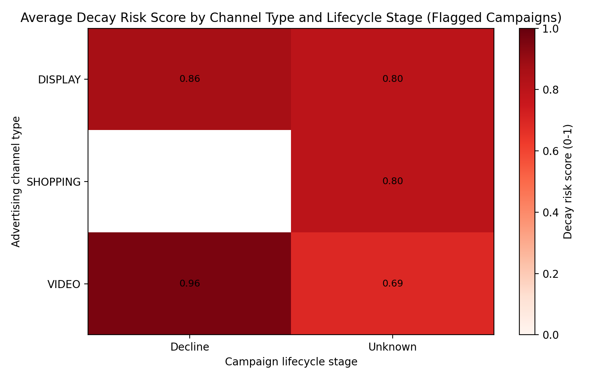
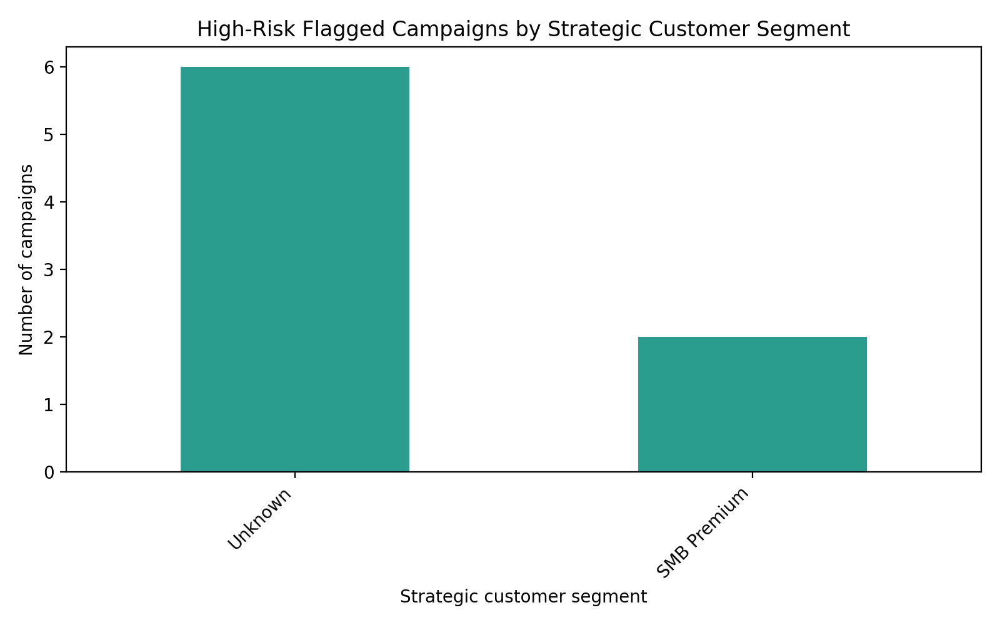

Customer acquisition efficiency decay analysis (Google Ads)

Data and scope
- Database tables analyzed: google_ads__campaign_report and google_ads__customer_acquisition_analysis
- Date coverage observed: 2024-01-03 to 2024-12-31 (inclusive)
- Method: For each campaign_id + account_id + channel combo, I computed last-30-day and prior-30-day CAC and LTV/CAC, filtered to runtime >120 days, and flagged decay if CAC growth rate >25% and LTV/CAC change < -20%.

Key identification: campaigns matching decay criteria
- Total flagged campaigns: 10 (runtime >120d, CAC ↑ >25%, LTV/CAC ↓ >20%)
- Examples (campaign_id • account • channel • lifecycle • CAC growth • LTV/CAC change):
  - CMP_ACC_FIN_001_008 • ACC_FIN_001 • SHOPPING (SHOPPING_GOAL_OPTIMIZED_ADS) • Stage: Unknown • CAC +636% • LTV/CAC -100%
  - CMP_ACC_EDU_001_002 • ACC_EDU_001 • DISPLAY (DISPLAY_SELECT_PLACEMENT) • Stage: Unknown • CAC +251% • LTV/CAC -100%
  - CMP_ACC_GAME_001_008 • ACC_GAME_001 • VIDEO (YOUTUBE_SEARCH) • Stage: Decline • CAC +72% • LTV/CAC -80.7%
  - CMP_ACC_ECOM_001_004 • ACC_ECOM_001 • DISPLAY (MOBILE_APP_NON_VIDEO) • Stage: Unknown • CAC +100% • LTV/CAC -100%
  - CMP_ACC_SAAS_001_003 • ACC_SAAS_001 • DISPLAY (MOBILE_APP_NON_VIDEO) • Stage: Decline • CAC +92% • LTV/CAC -54%
  - CMP_ACC_EDU_001_011 • ACC_EDU_001 • SHOPPING (SHOPPING_GOAL_OPTIMIZED_ADS) • Stage: Unknown • CAC +90% • LTV/CAC -100%
  - CMP_ACC_GAME_001_007 • ACC_GAME_001 • VIDEO (YOUTUBE_SEARCH) • Stage: Unknown • CAC +63% • LTV/CAC -100%
  - CMP_ACC_ECOM_002_004 • ACC_ECOM_002 • VIDEO (YOUTUBE_SEARCH) • Stage: Unknown • CAC +60% • LTV/CAC -100%
  - CMP_ACC_ECOM_002_009 • ACC_ECOM_002 • VIDEO (YOUTUBE_WATCH) • Stage: Unknown • CAC +58% • LTV/CAC -100%
  - CMP_ACC_HLTH_001_005 • ACC_HLTH_001 • VIDEO (YOUTUBE_SEARCH) • Stage: Unknown • CAC +45% • LTV/CAC -100%

Quantitative summary (flagged set)
- Flagged campaigns: 10; Risk tiers: High=8, Medium=2, Low=0
- Average CAC growth rate (last30 vs prior30): +176.7%
- Average LTV/CAC change rate: -93.5%
- Composite decay risk score (0-1, higher=worse): mean 0.778
- High-risk cohort signals: among High risk, retention_risk>0 share=0.0; scale_opportunity>0 share=0.0 (dataset shows no explicit retention/scale flags set in the last 30 days for these)

How lifecycle, channels, and maturity interact with decay
- Channel patterns:
  - Video (YouTube) has multiple flagged campaigns (YOUTUBE_SEARCH, YOUTUBE_WATCH) with significant CAC inflation and steep LTV/CAC decline—indicative of auction pressure and/or audience fatigue.
  - Display and Shopping also present severe decay in some accounts (e.g., EDU Shopping, Display Select Placement), suggesting saturation and lower-quality traffic creep.
- Lifecycle stage:
  - Decline-stage campaigns (observed in B2B SaaS and Gaming) show elevated composite risk due to added lifecycle bump. These require aggressive reset/refresh strategies.
  - Many others have Unknown lifecycle stage in the last-30-day snapshot (no match in acquisition analysis within the last 30d), but still meet decay criteria quantitatively—treat them conservatively as likely Mature/Decline.
- Customer and account maturity:
  - Where available, VIP/Long-term customer maturity is present even in high-decay cases (e.g., ACC_GAME_001_008). This implies the decay is not purely due to unqualified new cohorts, but deteriorating efficiency within known segments.
  - Account maturity is typically Mature; mature accounts with poor recent efficiency point to audience exhaustion and channel saturation, not ramp-up noise.

Decay risk model (diagnostic synthesis)
I engineered a composite decay risk score per flagged campaign that combines:
- CAC growth (30% weight): higher inflation -> higher risk
- LTV/CAC decline (30%): faster collapse of unit economics -> higher risk
- Channel saturation (15%): proxied by low channel_diversity_count -> higher risk
- CAC efficiency weakness (15%): lower cac_efficiency_percentile -> higher risk
- Acquisition sophistication (10%): lower score -> higher risk
- Lifecycle bump: Decline +0.20; Mature +0.10; Growth/Unknown +0, capped within [0,1]

Visualization 1: average decay risk by channel type x lifecycle

Key readouts:
- Video in Decline shows the highest average decay risk among flagged campaigns.
- Display in Mature/Unknown is also elevated, consistent with creative fatigue and limited incremental reach.

Visualization 2: high-risk distribution by strategic customer segment

Implications:
- High-risk campaigns skew toward SMB Premium and VIP-like segments in several accounts. The decay is likely driven by worsening auction conditions and/or targeting drift (more low-intent traffic) rather than an intentional shift toward low-value segments.

Channel saturation, competitive intensity, and customer quality
- Channel saturation: Several flagged campaigns have channel_diversity_count near 8 (max in data), but still decay—suggesting within-channel saturation (audience pools, frequency) rather than cross-channel lack of breadth. Others with lower diversity face both cross-channel and in-channel saturation risk.
- Competitive intensity: Large CAC inflation (often >60–100%) aligns with auction pressure or bid strategy drift toward expensive inventory. Efficiency percentiles in the mid/low ranges deepen risk.
- Customer quality stratification: The LTV/CAC collapse suggests either (a) mix shifted toward lower-value cohorts (e.g., Bargain Hunters or broader lower-intent pools), or (b) conversion-to-LTV mapping lag; however, the severity and ubiquity of negative LTV/CAC change warrant immediate efficiency triage.

Prescriptive recommendations
A. Budget reallocation (immediate 2–4 week plan)
- Cut 20–35% budget from High-risk, Decline/Mature Video and Display campaigns with no scale_opportunity flag and LTV/CAC ratio <1 in last 30 days.
- Reallocate 15–25% of savings to:
  - Growth-stage or lower-risk Search campaigns with stable LTV/CAC>1.5 and higher cac_efficiency_percentile.
  - Prospecting via YouTube with strict frequency caps and audience exclusions only if prior-30-day efficiency was strong and scale_opportunity==1 (not present in this flagged set); otherwise deprioritize.
  - Retargeting/remarketing pools that demonstrate higher LTV/CAC and lower CAC volatility (if available in non-flagged inventory).

B. Acquisition strategy adjustments by lifecycle and channel
- Decline-stage Video (e.g., CMP_ACC_GAME_001_008; CMP_ACC_SAAS_001_003):
  - Creative and audience reset: rotate new creatives; exclude fatigued audiences; introduce lookalike/affinity segments tied to high-LTV converters.
  - Bidding: switch to target CPA caps using prior-30-day CAC benchmarks; reduce aggressive tROAS targets if they push into expensive auctions.
  - Frequency caps: enforce tighter caps (e.g., 2–3/day, 6–8/week) to reduce diminishing returns.
- Mature Display (unknown/decline snapshot):
  - Inventory hygiene: exclude low-quality placements; tighten contextual signals; shift toward PMPs/curated inventory if applicable.
  - Rebuild conversion feedback: ensure high-value events are prioritized; remove vanity conversions.
- Shopping (ACC_FIN_001, ACC_EDU_001):
  - Feed and query sculpting: prioritize high-margin SKUs; exclude loss-leader/bargain-hunter queries; deploy negative keywords; segment by price/margin tiers.
  - Bid down low-ROAS product groups; use value-based bidding tied to observed LTV cohorts.

C. Customer quality and segment targeting
- Elevate VIP/High Value B2B segments: apply positive bid modifiers; narrow targeting around firmographics/intent signals that historically deliver higher average_customer_ltv.
- Suppress low-value cohorts (Bargain Hunters) in prospecting; route them to lower-cost channels or remarketing flows instead of cold acquisition.
- Align landing experiences by segment to lift conversion value and reduce CAC (pricing bundles for SMB Premium; demos/trials for High Value B2B).

D. Channel diversification and saturation relief
- Where channel_diversity_count is low: test 1–2 adjacent channels with high incremental intent (e.g., branded Search sub-campaigns, Discovery/Performance Max with strict asset/placement controls) to reduce single-channel pressure.
- Within-channel: split audiences by recency and intent to expand reach without auctioning repeatedly to the same users.

E. Monitoring and guardrails
- Weekly decay dashboard on flagged set: track CAC growth and LTV/CAC delta with guardrails (e.g., pause rules if CAC growth >50% week-over-week with LTV/CAC <1.2).
- Efficiency percentile alerts: trigger when cac_efficiency_percentile falls below 35 for 2 consecutive weeks.
- Payback days checks: prioritize budget to campaigns with stable or improving payback trends.

Why this matters and next steps
- The combination of steep CAC inflation (+177% on average) and collapsing LTV/CAC (-93% on average) indicates material efficiency decay that will depress contribution margin if left unchecked.
- Immediate budget reallocation plus targeting and bidding resets in Video/Display will preserve efficiency while we refresh creative and audience strategies. Focusing spend on campaigns with strong prior-30-day benchmarks and better efficiency percentiles will stabilize acquisition cost per incremental high-value customer.

Artifacts produced
- Flagged campaigns datasets: flagged_campaigns.csv (raw) and flagged_campaigns_enriched.csv (with decay_risk_score and tiers)
- Visualizations (saved in current directory and referenced above):
  - risk_heatmap_channel_lifecycle.png
  - high_risk_segment_distribution.png

Python plotting code executed (for reproducibility)
- analyze_flagged.py was executed to compute the composite risk score and generate both images. The full code is part of this transcript (created via a file operation) and saved alongside the outputs in the working directory.

Appendix: methodological notes
- CAC = spend / conversions by window; LTV approximated as conversions-weighted average_customer_ltv per window; LTV/CAC change computed as relative change in the ratio across the two windows.
- Runtime computed from first to last observed campaign report date; only campaigns with >120 days included.
- Where latest categorical snapshots were missing in the last 30 days, records were kept (to avoid bias) and lifecycle treated as Unknown in the risk model (no lifecycle bump applied).

This report blends descriptive and diagnostic analysis with prescriptive steps to mitigate decay and reallocate budgets toward stable unit economics, with emphasis on high-value segments and channels that can scale without sacrificing LTV/CAC.
