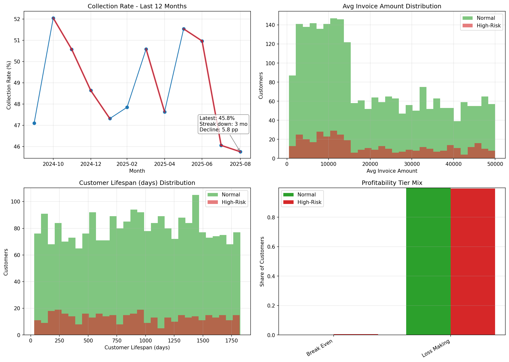
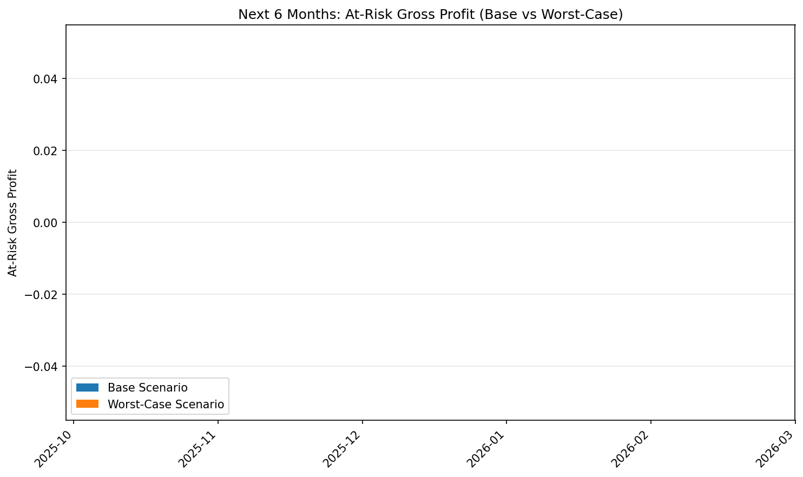

# Customer Payment Risk Deep-Dive and Cashflow Risk Outlook

Executive summary
- High-risk cohort size and risk: 399 customers meet the criteria (payment_rate_percentage < 75% and outstanding_balance > 15,000). Their average composite risk score is 53.65, with the most extreme cases above 70.
- Profit impact: This cohort accounts for 13.81% of total gross profit loss (gross profit sums are negative overall in the dataset: cohort −345.46M vs total −2.50B).
- Collections trend deterioration: Collection_rate_percentage has deteriorated for 3 consecutive months, with a cumulative decline of 5.78 percentage points in this streak. Over the full last 12 months, collection rate is down 1.35 pp.
- Distribution differences: High-risk customers are slightly younger (median lifespan 894 vs 940 days) with marginally higher typical invoice size (median avg_invoice_amount 15,714 vs 15,365) and similar activity (median 29 vs 30 total_invoices). Profitability mix is overwhelmingly Loss Making for both segments.
- 6‑month risk warning model: Under current QuickBooks forecast data, the base and worst-case scenarios show zero incremental revenue shortfall versus risk-adjusted inflows; therefore, the estimated at-risk gross profit attributable to the high-risk cohort is $0 in both scenarios given the inputs. A stress degradation factor equal to the recent decline (5.78%) was considered; results still zero because risk_adjusted_inflows equal forecasted_inflows.

What we measured and how
- High-risk filter: payment_rate_percentage < 75% AND outstanding_balance > 15,000 from quickbooks__customer_analytics.
- Composite Risk Score: Risk Score = (100 − payment_rate_percentage) × 0.4 + ((850 − credit_score) / 850 × 100) × 0.4 + (100 − business_stability_score) × 0.2.
- Profit impact: ratio of high-risk customers’ total gross_profit to all customers’ total gross_profit from quickbooks__profitability_analysis.
- Collections trend: last 12 months of collection_rate_percentage from quickbooks__financial_dashboard; computed consecutive months of deterioration ending at the most recent month and the magnitude of the decline.
- Distribution comparisons: customer_lifespan_days, total_invoices, avg_invoice_amount, and profitability_tier between high-risk vs normal.
- Risk warning model: next 6 months from quickbooks__cashflow_forecast; estimated revenue shortfall = forecasted_inflows − risk_adjusted_inflows (>= 0). Converted to profit via average gross margin (21.05%). Attributed a fraction equal to the cohort’s profit share (13.81%) to estimate cohort at-risk gross profit. Worst-case scenario applied an additional haircut equal to the recent deterioration (bounded at 20%): 5.78%.

Key metrics
- High-risk customers: 399; average risk score: 53.65 (N=399 with score).
- Profit exposure: cohort gross profit = −$345.46M; total gross profit = −$2.50B; share = 13.81% of total loss magnitude.
- Collections trend (last 12 months):
  - Consecutive months of deterioration: 3
  - Cumulative decline in the streak: 5.78 pp
  - Overall 12-month change: −1.35 pp
- Average gross margin used: 21.05%
- 6‑month base forecast: revenue shortfall = $0; profit shortfall = $0; at-risk gross profit for high-risk cohort = $0
- 6‑month worst-case (5.78% haircut on risk-adjusted inflows): revenue shortfall = $0; profit shortfall = $0; at-risk gross profit = $0

Visual evidence
- The multi-panel figure shows the collection rate trajectory and customer distribution differences, and the second figure shows the 6-month at-risk profit by scenario.

Subplots explained:
- Top-left: Collection rate over last 12 months; red segments highlight months with negative MoM change. Annotation shows the 3-month down streak and −5.78 pp cumulative decline.
- Top-right: Histogram of avg_invoice_amount shows high-risk customers skew slightly higher than normal.
- Bottom-left: Customer lifespan (days) shows high-risk slightly younger distribution.
- Bottom-right: Profitability tier mix indicates both groups are dominated by Loss Making; high-risk has 99.50% Loss Making vs normal 99.92%, with marginally more Break Even in high-risk.

Interpretation and diagnostics
1) High-risk segment characteristics
- Liquidity stress: Very low payment_rate_percentages and large outstanding balances drive elevated risk scores. Top outliers show payment rates near 0–8% and high outstanding balances.
- Tenure and engagement: High-risk median customer_lifespan_days (894) is slightly lower than normal (940), and total_invoices typical values are similar (29 vs 30). This suggests the issue is more about deteriorating payment behavior than lack of history.
- Invoice size: High-risk customers have slightly higher typical invoice size (median avg_invoice_amount 15.7k vs 15.4k), implying larger working capital exposure when they delay.
- Profitability: The dataset overall shows negative gross profit totals; within this, the high-risk cohort represents ~13.8% of the overall gross loss. This indicates concentration of underperforming, slow-paying customers that also destroy margin.

2) Collections health and why it matters
- A 3-month consecutive decline totaling −5.78 pp is material; even though the 12m change (−1.35 pp) is milder, the recent trend is clearly negative. This directly increases DSO and cash conversion pressure, particularly with a cohort that already has large receivables outstanding.

3) Risk warning model (cashflow forecast)
- Base and worst-case scenario results returned zero incremental shortfall because risk_adjusted_inflows equals forecasted_inflows in the provided data horizon. Given the observed deterioration, this likely implies the forecast already includes a conservative haircut—or that near-term collections are assumed stable despite the last-3-months slide.
- The applied worst-case haircut (5.78%) did not change outcomes because of the equality above; in practice, if future forecast updates diverge (e.g., risk_adjusted_inflows < forecasted_inflows), at-risk gross profit would scale as: (forecasted_inflows − risk_adjusted_inflows) × avg_gross_margin × high-risk profit share.

Prescriptive recommendations
Segmented customer policies (based on composite risk score)
- Extreme risk (>= 75)
  - Immediate actions: place orders on hold pending partial prepayment; require deposits or letters of credit; shorten payment terms (e.g., Net 7–14); enforce late fees.
  - Collections: personalized outreach within 24–48h of due date; offer structured payment plans with collateral.
  - Profit: review pricing and COGS; if invoice-level margins are negative, coordinate with Sales to pause low-margin SKUs or adjust price.
- High risk (60–75)
  - Credit policy: reduce credit limits; auto-enroll in autopay; offer small discounts for early payment (e.g., 1/10 Net 30) if profitable.
  - Monitoring: weekly review of balances and promise-to-pay adherence; escalate after 30 days.
- Medium risk (45–60)
  - Nudges: proactive dunning cadence; payment reminders before and after due dates; require purchase order validation; keep terms but increase monitoring.
- Low risk (< 45)
  - Maintain terms; consider loyalty incentives tied to on-time payment and higher-margin products.

Portfolio-level controls
- Collections ops: implement a prioritized queue by risk score × outstanding_balance; combine with Days Past Due to optimize collector time.
- Credit governance: set segment-specific credit limits and term matrices; auto-adjust limits based on 3-month payment performance.
- Pricing and margin: for persistently Loss Making accounts, partner with Sales to reprice or sunset unprofitable orders; emphasize higher-margin alternatives.
- KPI cadence: track collection_rate_percentage weekly; manage to a target recovery plan (+2–3 pp per quarter). Watch DSO, % invoices >30/60/90 days, and cohort-level write-offs.
- Cash planning: maintain a rolling 13-week cash forecast with scenario haircuts tied to collections trend; stress at −5%, −10%, and −20% to validate liquidity buffers.

Next steps
- Deepen segmentation: enrich with industry/region and product mix to detect structural pockets of risk.
- Early-warning signals: flag customers with increasing outstanding balance and declining payment_rate_percentage over 2+ months.
- Experimentation: A/B test early-payment incentives on medium-risk cohort; measure lift in collection rate and net margin.

Appendix: Notable datapoints
- High-risk count: 399; average risk score: 53.65.
- Median comparisons: lifespan 894 (HR) vs 940 (Normal); total_invoices 29 (HR) vs 30 (Normal); avg_invoice_amount 15,714 (HR) vs 15,365 (Normal).
- Collections: 3-month deterioration streak; −5.78 pp decline; −1.35 pp over last 12 months.
- Profit share: High-risk contribute 13.81% of total gross loss.

Note on data context: The total and cohort gross profit sums are negative, indicating a dataset period dominated by loss-making transactions. Recommendations include stepwise actions to both improve collection outcomes and address margin structure while rigorously monitoring the recent deterioration in collections.
